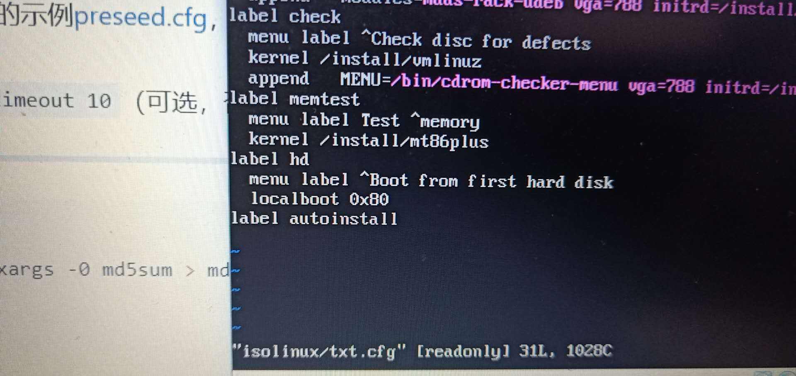
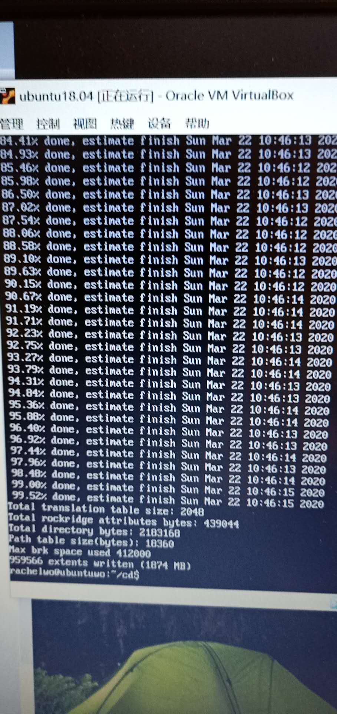
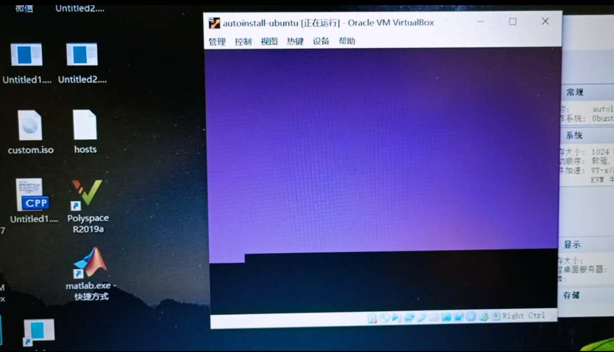
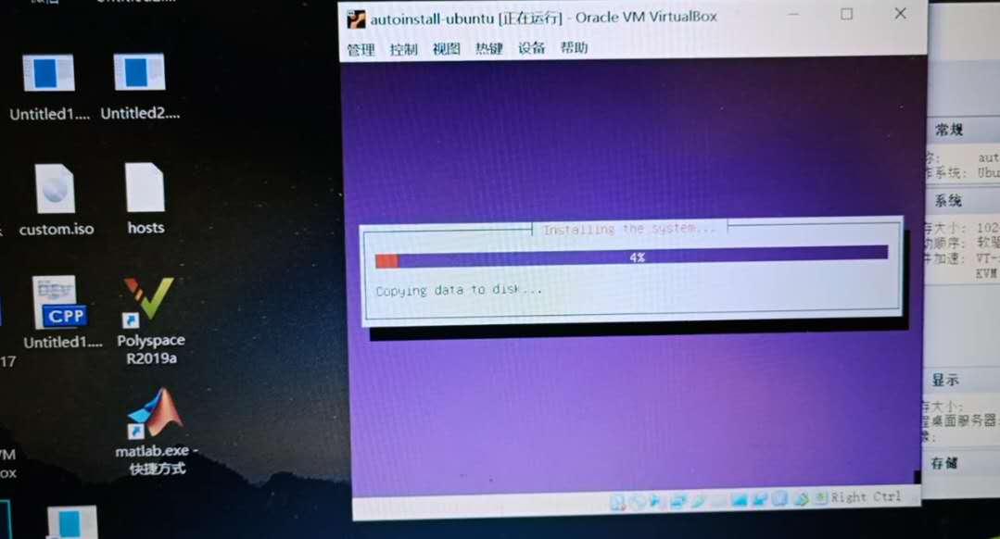
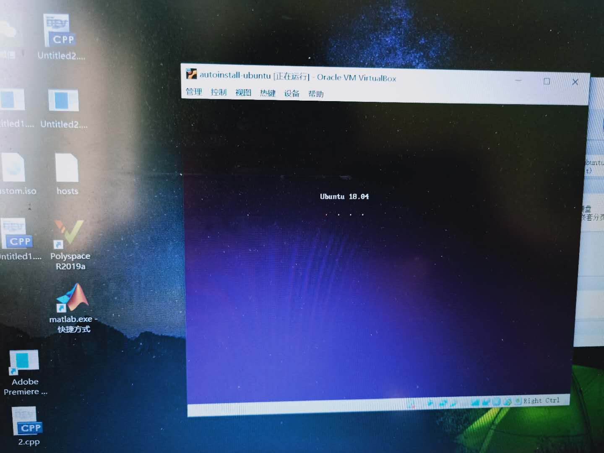
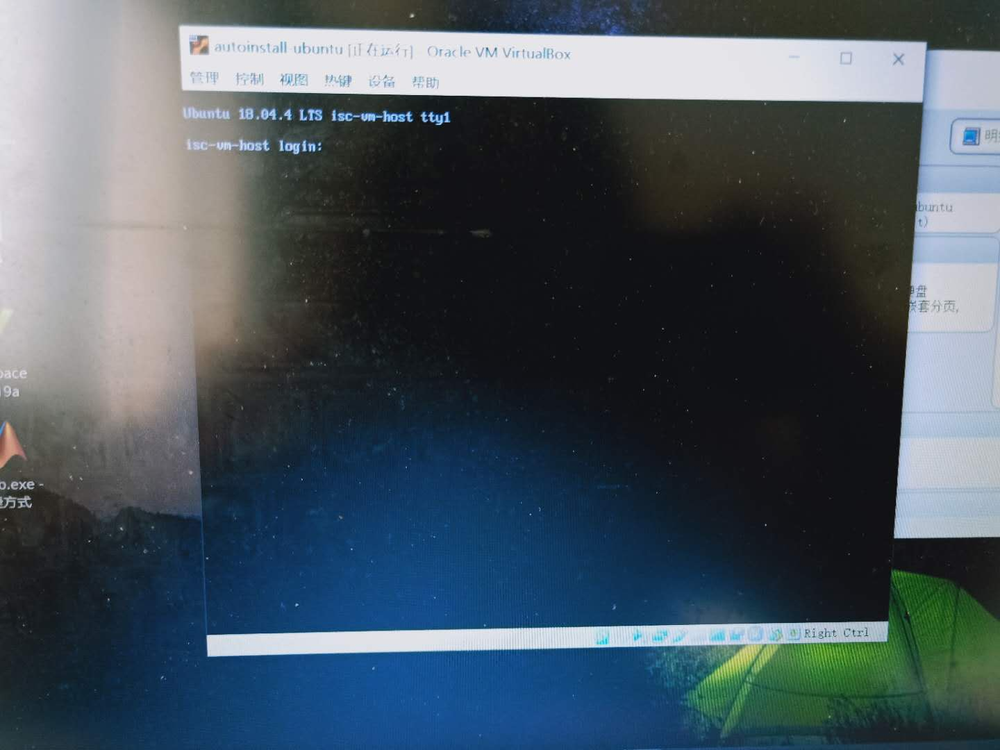

# Linux 无人值守安装实验 
***挂载iso镜像文件到新创建的目录***  

**出现问题**：  
* 无法执行mount命令    
* 无法形成回环设备    
* 无法传输文件到虚拟机  

**解决：**  
* 发现问题一：普通用户没有mount权限，于是用 **sudo su**命令以root权限登入。      
*  报出 *无法形成回环设备*  的错误，通过语雀，有同学提醒可以直接把文件传到虚拟机后再挂载，于是下载了filezilla辅助文件传输。  
*  filezilla无法建立与虚拟机的连接，做出如下操作：在虚拟机里打开ssh服务，关闭windows防火墙，将虚拟机的网卡1联网方式设置为桥接。（打开ssh时网络连接方式只能是nat，而建立主机连接时则只能是桥接）  
  
**参考**：  
[提及需要设置桥接网络](https://blog.csdn.net/FormatFa/article/details/83070629)   
[安装ssh服务的方法](https://blog.csdn.net/solo_jm/article/details/103714414)  
[建立新站点法](https://blog.csdn.net/xiaobai_IT_learn/article/details/89211359?depth_1-utm_source=distribute.pc_relevant.none-task&utm_source=distribute.pc_relevant.none-task)  
[获取root权限的几种方法](https://blog.csdn.net/huplion/article/details/53446010?depth_1-utm_source=distribute.pc_relevant.none-task&utm_source=distribute.pc_relevant.none-task) 
    
***克隆iso文件***    
修改配置文件  

**出现问题**：  
误将 label auto install之后的内容写在了配置文件的最后  
使用vim编辑配置文件，出现**只读**字样    

**解决**：  
简单修改，将其强制保存即可  

**参考**：  
[vim退出命令](https://blog.csdn.net/weixin_43820866/article/details/95330271)   

***修改并保存配置文件***  
通过将老师提供的文档与官方文档两相对比，最大的区别在于IP地址，子网掩码和默认网关，在主机命令行里输入**IPconfig**命令获取以上信息并修改保存  

**问题**：文件在普通用户目录下，但普通用户没有移动文件的权限 ，报错**permission denied** 

**解决**：  
授权  

**参考**：  
[mv指令的运用](https://www.cnblogs.com/dereckbu/p/7521681.html)  
[permission denied 解决方法](https://www.cnblogs.com/ggband/p/10665312.html)

***生成新的iso文件***   
  

***新建虚拟机，虚拟硬盘，将刚生成的ISO镜像作为虚拟光驱***  
    
***开始无人值守安装***  
安装过程中自动跳转界面
  
安装中的一个进度条
  
开机界面
  
登入界面
   

***Virtualbox安装完Ubuntu之后新添加的网卡如何实现系统开机自动启用和自动获取IP？*** 
* 通过配置DHCP自动获取IP    
    
  sudo vi /etc/network/interfaces  
auto eth0  
iface eth0 inet dhcp  
* 参考[ubuntu配置DHCP](https://jingyan.baidu.com/article/9113f81b7995df2b3214c702.html)  
* 网卡状态  
  
***如何使用sftp在虚拟机和宿主机之间传输文件？***  
* 可以从我的实验过程看出，我下载了filezilla来用sftp协议传输文件到虚拟机，过程是：建立新站点--输入桥接网卡IP--输入用户名密码--端口选择22--连接  
* 然后我查了一些关于命令行里使用sftp的方法  
* [命令行内使用sftp](https://www.sohu.com/a/295816268_185201)  
  
**另：**  
* 在开始配置双网卡的时候，因为之前在虚拟机里生成了备份所以无法改为多重加载，参考语雀上同学的回答，删除备份后成功操作。  
* 后又发现无法自动生成硬盘（Ubuntu虚拟机左侧没有三角符号），是因为我只装载了虚拟光驱，装载虚拟硬盘后解决。

