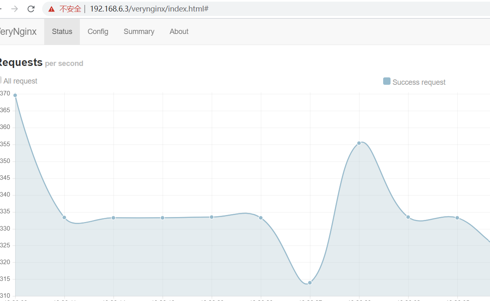
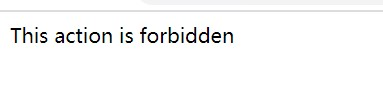

# chap0x05实验报告  
实验环境：
* ubuntu18.04  
* Nginx  
* VeryNginx  
* WordPress-4.7  
* DVWA  
## 实验环境的配置  
### **1.查看host-only网卡的ip地址**   
  ip a 结果如下：  

    
没有对应网址  
* 先尝试静态分配  
   * 进入/etc/network/interfaces修改文件，自己设定网卡对应网址，未生效  
   * 进入虚拟机全局工具--网络，在dhcp服务里发现静态分配地址是有范围的，而我分配的地址不在范围里，再次修改配置文件，未生效。
   * 了解到/etc/network/interfaces已经不适用于ubuntu18.04了，放弃此方法   
   * 打开dhcp服务，进入windows主机的网络设置  
     
   发现这里的ip地址和虚拟机的不一样，修改成一致的，再次ip a,获得ip地址为192.168.6.3

### **2.安装Nginx**  
```
sudo apt-get update
sudo apt-get install nginx  
```  
### **3.安装VeryNginx**  
```  
sudo apt-get install libssl-dev1.0   

sudo apt-get libpcre3 libpcre3-dev build-essential 
#这两项是安装文档里要求的依赖项 

git clone https://github.com/alexazhou/VeryNginx.git  

cd VeryNginx  

sudo python install.py install  
```  
* 报错：  
  * make cc……  
    * 是没有安装gcc，无法提供编译环境所致  
    
### **4.启动VeryNginx**    
```/opt/verynginx/openresty/nginx/sbin/nginx```  
* 报错：
  * 80端口被占用  
    * 进入配置文件改变监听端口  
     ```     
     sudo vim /opt/verynginx/openresty/nginx/conf/nginx.conf  
     ```  
     将sever模块的listen改为：192.168.6.3：80；
  * 仍然因为端口占用而无法打开  
    * 查看端口占用情况  
        ```netstat -lnp|grep 80```  
        发现是apache2占用了80端口  
        尝试改变apache2的监听端口仍然不能成功启动VeryNgnix,于是关闭apache2服务  
        ```  sudo /etc/init.d/apache2 stop ```  
        成功启动  
          
### **5.安装wordpress**  
* 安装mysql  
```  
sudo apt-get install mysql-server
sudo service mysql start
mysql -u root -p

#进入mysql

#创建wordpress独立数据库
mysql>CREATE DATABASE wordpress DEFAULT CHARACTER SET utf8 COLLATE utf8_unicode_ci;

#创建账户，设置密码
mysql>GRANT ALL ON wordpress.* TO 'wordpressuser'@'localhost' IDENTIFIED BY '********';

#刷新更改
mysql>FLUSH PRIVILEGES;

mysql>EXIT;  
```  
* 安装php  
```  
sudo apt-get update

#安装php7.2
sudo apt-get install php7.2  
  
#安装php7.2-fpm
sudo apt-get install php7.2-fpm   

#安装相关依赖
sudo apt-get install php-curl php-gd php-intl php-mbstring php-soap php-xml php-xmlrpc php-zip

#重启php
sudo systemctl restart php7.2-fpm  
```
* 下载wordpress-4.7   
```  
#解压
unzip wordpress-4.7

#复制配置文件到wordpress实际读取的文件中
cp /tmp/wordpress-4.7/wp-config-sample.php /tmp/wordpress-4.7/wp-config.php

#创建wordpress根目录
mkdir /var/www/html/wp.sec.cuc.edu.cn

#将tmp目录下文件复制到根目录
sudo cp -a /tmp/wordpress-4.7/. /var/www/html/wq.sec.cuc.edu.cn

#分配文件所有权给用户
sudo chown -R nginx /var/www/  
```  
这里要提前添加一个nginx用户（verynginx里的默认项）  
- 报错： 
  * 无法解压  
    * 安装zip library可解决  
* 配置nginx  
```  
  #更改文件名
sudo mv /etc/nginx/sites-available/default /etc/nginx/sites-available/wp.sec.cuc.edu.cn

#进入文件并修改
sudo vim /etc/nginx/sites-available/wp.sec.cuc.edu.cn

#在主server块中，添加几个location块
server {
    . . .

    location = /favicon.ico { log_not_found off; access_log off; }
    location = /robots.txt { log_not_found off; access_log off; allow all; }
    location ~ \.php$ {
            include snippets/fastcgi-php.conf;
            fastcgi_pass unix:/var/run/php/php7.2-fpm.sock;
    }
    location ~ /\.ht{
            deny all;
    }
    location ~* \.(css|gif|ico|jpeg|jpg|js|png)$ {
        expires max;
        log_not_found off;
    }
    . . .
}

#在现有location/块内部，调整try_files列表，以便不是将404错误作为默认选项返回，而是index.php使用请求参数将控制传递给文件
server {
    . . .
    location / {
        try_files $uri $uri/ /index.php$is_args$args;
    }
    . . .
}

#修改root
root /var/www/html/wp.sec.cuc.edu.cn;

#修改server name
server_name 192.168.56.103;

在index.html前加上index.php  
#之前因为忽略掉这一步无法访问网站
```  
* 创建软连接  
  ``` sudo ln -s /etc/nginx/sites-available/wp.sec.cuc.edu.cn /etc/nginx/sites-enabled/```  
* 取消链接默认配置文件  
  ``` sudo unlink /etc/nginx/sites-enabled/default```  
* 查看配置文件是否有错误  
  sudo nginx -t  
    
* 重新加载nginx  
* 配置wordpress的配置文件  
  * 从wordpress密钥生成器中获取安全值  
  ``` curl -s https://api.wordpress.org/secret-key/1.1/salt/```  
  （这一步要把apache打开）  
* 替换文件相应部分   
``` sudo vim /var/www/html/wp.sec.cuc.edu.cn/wp-config.php```    
  
```  
define('DB_NAME', 'wordpress');

define('DB_USER', 'wordpressuser');

define('DB_PASSWORD', '********');
···
define('FS_METHOD', 'direct');  
```  
* 配置完成，用浏览器打开192.168.6.3  
  * 界面是openresty  
  * 修改wordpress配置文件里的端口为8090  
  * 用浏览器打开192.168.6.3：8090，成功  
    
### **6.安装dvwa** 
```  
# 在/var/www/html下为DVWA创建目录
sudo mkdir /var/www/html/DVWA

# 将安装仓库克隆到临时目录下
git clone https://github.com/ethicalhack3r/DVWA /tmp/DVWA

# 将安装文件拷贝到/var/www/html/DVWA网站根目录下
sudo rsync -avP /tmp/DVWA/ /var/www/html/DVWA   
```   
```  
 #复制config.inc.php.dist到config.inc.php
cp /var/www/html/DVWA/config/config.inc.php.dist /var/www/html/DVWA/config/config.inc.php  
```  
```  
# 新建数据库dvwa
CREATE DATABASE dvwa DEFAULT CHARACTER SET utf8 COLLATE utf8_unicode_ci;

# 创建用户名dvwauser,分配管理权限并设置密码
GRANT ALL ON dvwa.* TO 'dvwauser'@'localhost' IDENTIFIED BY 'p@ssw0rd';

# 刷新配置
FLUSH PRIVILEGES;

# 退出
exit；

# 重启mysql
sudo systemctl restart mysql  
```  
```  
sudo sudo vim /var/www/html/DVWA/config/config.inc.php

#进行修改
$_DVWA[ 'db_server' ]   = '127.0.0.1';
$_DVWA[ 'db_database' ] = 'dvwa';
$_DVWA[ 'db_user' ]     = 'dvwauser';
$_DVWA[ 'db_password' ] = 'p@ssw0rd';  
```  
```  
#修改/etc/php/7.2/fpm/php.ini
vim /etc/php/7.2/fpm/php.ini

#修改
allow_url_include = On
allow_url_fopen = On
display_errors = Off

#修改DVWA文件访问权限
sudo chown -R nginx /var/www/html/  
```  
```  
# 将/etc/nginx/sites-available下的wp.sec.cuc.edu.cn复制新文件改名为dvwa
cp /etc/nginx/sites-avaliable/wp.sec.cuc.edu.cn /etc/nginx/sites-avaliable/dvwa

# 将监听端口改为8088
listen 8088;
listen [::]:8088 ipv6only=on;

#将root目录进行更改
root /var/www/html/DVWA;

# 创建软连接
sudo ln -s /etc/nginx/sites-available/dvwa /etc/nginx/sites-enabled/

# 重启nginx
sudo systemctl restart nginx  
```  
* 登录dvwa，报错没有安装数据库扩展
* 安装 php-mysql即可
* 再次登录，成功  
    
## 实验要求  
  * 使用Wordpress搭建的站点对外提供访问的地址为： https://wp.sec.cuc.edu.cn  
  ```  
   #修改/etc/nginx/sites-available/wp.sec.cuc.edu.cn的server_name
server_name wp.sec.cuc.edu.cn   

#在/etc/hosts中添加
192.168.56.103 wp.sec.cuc.edu.cn  
  
#在本机C:\windows\system32\dirvers\etc\hosts中添加
192.168.56.103 wp.sec.cuc.edu.cn  
```  
  
dvwa配置相同  
  
* 本次实验要求中verynginx的matcher所有配置  
    
* 本次实验要求中verynginx的filter所有配置  
  
* 反向代理  
  
   

*   在不升级Wordpress版本的情况下，通过定制VeryNginx的访问控制策略规则，热修复WordPress < 4.7.1 - Username Enumeration  
    * 将实验要求里给出的脚本中的URL改成：http://192.168.6.3:8090/ 并保存为poc.php    
     * ```php poc.php ``` 
    
* 安全加固  
    * 使用IP地址方式均无法访问上述任意站点 并向访客展示自定义的友好错误提示信息页面-1   
    matcher见上图11  
   
    * Damn Vulnerable Web Application (DVWA)只允许白名单上的访客来源IP，其他来源的IP访问均向访客展示自定义的友好错误提示信息页面-2  
    matcher 10  
       
     *   通过配置VeryNginx的Filter规则实现对Damn Vulnerable Web Application (DVWA)的SQL注入实验在低安全等级条件下进行防护  
     matcher 9  
          
* verynginx相关：  
    * VeryNginx的Web管理页面仅允许白名单上的访客来源IP，其他来源的IP访问均向访客展示自定义的友好错误提示信息页面-3  
    matcher 15  
    
    * 限制DVWA站点的单IP访问速率为每秒请求数 < 50  
    * 限制Wordpress站点的单IP访问速率为每秒请求数 < 30  
    * 超过访问频率限制的请求直接返回自定义错误提示信息页面-4  
         frenquency limit  
      
    *  禁止curl访问  
    matcher 5
## 参考资料：
* https://github.com/CUCCS/linux-2019-laolaodeyang
* https://github.com/CUCCS/linux-2019-FukurouNarthil
* [virtualbox host-only](https://www.cnblogs.com/findumars/p/7701423.html)  
* [nginx启动失败](https://blog.51cto.com/10950710/2309269?source=dra)  
* [php-fpm安装](https://blog.csdn.net/ivan820819/article/details/54970330)
* [修改apache2监听端口](https://www.myvoipapp.com/blogs/yxh/2011/02/11/修改apache2的监听端口/)