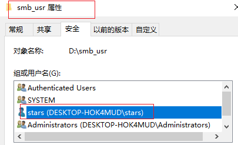
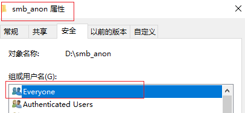

# chap0x06实验报告  
> FTP、NFS、DHCP、DNS、Samba服务器的自动安装与自动配置
## 实验要求
   参照[chap0x06课件](https://c4pr1c3.github.io/LinuxSysAdmin/chap0x06.md.html#/1)、[shell脚本编程基本要求](https://c4pr1c3.github.io/LinuxSysAdmin/chap0x06.exp.md.html#/shell)
   * FTP
     * 对照第6章课件中的要求选择一款合适的FTP服务器软件支持所有任务要求
   * NFS
     * 对照第6章课件中的NFS服务器配置任务
   * DHCP
     * 2台虚拟机使用Internal网络模式连接，其中一台虚拟机上配置DHCP服务，另一台服务器作为DHCP客户端，从该DHCP服务器获取网络地址配置
   * Samba
     * 对照第6章课件中smbclient一节的3点任务要求完成Samba服务器配置和客户端配置连接测试
   * DNS
     * 基于上述Internal网络模式连接的虚拟机实验环境，在DHCP服务器上配置DNS服务，使得另一台作为DNS客户端的主机可以通过该DNS服务器进行DNS查询
    在DNS服务器上添加`zone "cuc.edu.cn"` 的以下解析记录
           ns.cuc.edu.cn NS
           ns A <自行填写DNS服务器的IP地址>
           wp.sec.cuc.edu.cn A <自行填写第5章实验中配置的WEB服务器的IP地址>
           dvwa.sec.cuc.edu.cn CNAME wp.sec.cuc.edu.cn
## 完成情况
  - [x] FTP自动安装、自动配置
  - [x] NFS自动安装、自动配置
  - [x] DHCP自动安装、自动配置
  - [x] DNS手动安装、手动配置
  - [x] Samba手动安装、半自动配置   
   
**配置远程目标主机的SSH免密root登录**  
工作主机：192.168.6.3    
目标主机：192.168.6.4
  * 目标主机SSH配置
    * 开启ssh服务：`sudo service ssh start`
    * 修改ssh配置文件`sudo vim /etc/ssh/sshd_config`
  
          #设置可通过口令认证SSH
          PasswordAuthentication yes
          #允许root用户登录
          PermitRootLogin yes
    
    * 重启ssh服务`sudo systemctl restart ssh`
    * 给root用户设置密码：`sudo passwd`(因为默认状态下不知道root密码，但第一次连接只能用密码)
  
  * 工作主机生成秘钥
        
         #生成一对公私钥,foo为文件名
         $ ssh-keygen -f .ssh/foo
         #将公钥传输至目标主机authorized_keys文件
         $ ssh-copy-id -i ~/.ssh/foo root@192.168.6.4
      
         #测试秘钥(此时需要输入root密码)
         $ ssh root@192.168.6.4
  * 设置免密登录
    * 取消root口令并禁用口令登录
         
          #修改目标主机配置文件
          $ sudo vim /etc/ssh/sshd_config
               PasswordAuthentication no
               PermitRootLogin without-password
          #重启ssh服务
          $ sudo systemctl restart ssh
  * root免密登录：`ssh -i ~/.ssh/foo root@192.168.6.4`  
# **FTP**
  * 服务器选择：vsftpd
  * 脚本文件：[vsftpd.sh](script/vsftpd.sh)
  * 配置文件：[/etc/vsftpd.conf](config/vsftpd.conf)
  * 通过工作主机运行脚本在目标主机安装vsftpd并完成相关配置
  
    * 将脚本文件`vsftpd.sh`拷贝到目标主机：`scp -i .ssh/foo vsftpd.sh root@192.168.6.4:/home/rachelwo/lab6`   
  * vsftpd.sh执行结果（因为当时电脑实在太卡了，截图都打不开，只能手机拍了，不好意思）
    
  * 配置一个提供匿名访问的FTP服务器，匿名访问者可以访问1个目录且仅拥有该目录及其所有子目录的只读访问权限  
    
  * 配置一个支持用户名和密码方式访问的账号，该账号继承匿名访问者所有权限，且拥有对另1个独立目录及其子目录完整读写（包括创建目录、修改文件、删除文件等）权限

    * 用户名密码登录

      
      
     

    * FTP用户不能越权访问指定目录之外的任意其他目录和文件（注意：不是通过 绝对路径 方式来遍历，而是验证通过 相对路径 （例如 cd ../../../../ ）方式无法翻出 FTP 服务器指定的当前用户的 家目录 访问到 家目录及其所有子目录 以外的任何其他目录）

      

    * 匿名访问权限仅限白名单IP来源用户访问，禁止白名单IP以外的访问
      
# **NFS**  
* 脚本文件：  
  * [客户端nfs_c.sh](script\nfs_c.sh)  
  * [服务端nfs_s.sh](script\nfs_s.sh)    
* 在1台Linux上配置NFS服务，另1台电脑上配置NFS客户端挂载2个权限不同的共享目录，分别对应只读访问和读写访问权限  
    
* host的/etc/exports文件中，设置home目录为可读可写，general目录为只读（注意：设置home目录为 NFS 共享可读可写是非常危险的一件事情，会破坏 NFS 服务器上用户家目录的权限设置。）  
  ```  
  /var/nfs/general 192.168.6.3(sync,no_subtree_check)
  /home    192.168.6.3(rw,sync,no_root_squash,no_subtree_check)```      
* 客户端共享目录中文件、子目录的属主、权限信息和在NFS服务器端的信息,uid和gid一致  
  

 
# **dhcp**  
* 脚本文件 [dhcp.sh](script/dhcp.sh)
  * 配置文件 
    * [/etc/dhcp/dhcpd.conf](config/dhcpd.conf) 
    * server配置
      * 通过`scp`将脚本`dhcp.sh`拷贝到目标主机，通过`ssh`方式远程执行脚本
      * 查看server配置文件

          $ vi /etc/netplan/01-netcfg.yaml

             network:
               version: 2
               renderer: networkd
               ethernets:
                 enp0s3:
                   dhcp4: yes
               enp0s8:
                 #必须静态配置
                 dhcp4: no
                 addresses: [192.168.6.5/24]

    * client配置
      * 查看client配置文件
            $ less /etc/netplan/01-netcfg.yaml

             network:
               version: 2
               renderer: networkd
               ethernets:
                 enp0s3:
                   dhcp4: yes
                 enp0s8:
                   dhcp4: yes

    * 实验结果
    
    
可以看到program name 里面已经有了dhcpd，表示该服务启动成功。
  * 参考[isc-dhcp-server](https://help.ubuntu.com/community/isc-dhcp-server)  
# **SAMBA**  
* **在windows 10客户端上连接Linux上的Samba服务器**
    * 脚本文件 [smb_srv.sh](script/samba.sh)
    * 配置文件 [/etc/samba/smb.conf](config/smb.conf)

    * 执行脚本smb_srv.sh
    > 配置文件目录：`/etc/samba/smb.conf`
    * 打开资源管理器，右键“此电脑”，选择“添加一个网络位置”
    * 输入共享文件夹路径(我这里输的是\\\192.168.6.3\guest)

    * 访问匿名目录，不用输入账号密码，且不可以创建文件夹
    

    * 访问指定用户文件夹，需要输入账号密码，且可以创建文件夹，(注：此处的账号密码是之前配置过的samba用户与密码)
      


    
  * **在Linux上连接Windows10上的服务器**
  > sudo apt install smbclient
     
    * Windows设置共享目录---参考[linux-public-JuliBeacon](https://github.com/CUCCS/2015-linux-public-JuliBeacon/blob/exp6/%E5%AE%9E%E9%AA%8C%206/%E5%9C%A8Linux%E5%92%8CWindows%E9%97%B4%E8%AE%BE%E7%BD%AE%E6%96%87%E4%BB%B6%E5%85%B1%E4%BA%AB.md)

      * 结果：账号密码登录共享目录`smb_usr`的用户为`stars` ，匿名登录共享目录`smb_anon`的用户为`Everyone`
        
        

    * Linux访问Windows的匿名共享目录
     

    * Linux访问Windows的用户名密码方式共享目录
     


# **DNS**  
* server  
    * 安装bind ```sudo apt-get install bind9 bind9utils bind9-doc```   
    * 设置信任客户端：```sudo vi /etc/bind/named.conf.options```  
    ```  
    acl "trusted" {
      192.168.6.3;    # ns1 - can be set to localhost
  }; ```  
 在options选项中添加  
  ```  
   recursion yes;                 # enables resursive queries
    allow-recursion { trusted; };  # allows recursive queries from "trusted" clients
    listen-on { 192.168.6.4; };   # ns1 private IP address - listen on private network only
    allow-transfer { none; };      # disable zone transfers by default

    forwarders {
            8.8.8.8;
            8.8.4.4;
    };  
```  
 * 编辑配置文件`sudo vim /etc/bind/named.conf.local`

          #添加如下配置
          zone "cuc.edu.cn" {
              type master;
              file "/etc/bind/db.cuc.edu.cn";
          };
 * 生成配置文件`db.cuc.edu.cn`

          $ sudo cp /etc/bind/db.local /etc/bind/db.cuc.edu.cn
    * 编辑配置文件`sudo vim /etc/bind/db.cuc.edu.cn`
     ```  
     ;
     ; BIND data file for local loopback interface
    ;
    $TTL    604800
    ;@      IN      SOA     localhost. root.localhost.(

    @       IN      SOA     cuc.edu.cn. admin.cuc.edu.cn. (
                                2         ; Serial
                            604800         ; Refresh
                            86400         ; Retry
                            2419200         ; Expire
                            604800 )       ; Negative Cache TTL
    ;
    ;@      IN      NS      localhost.
            IN      NS      ns.cuc.edu.cn.
    ns      IN      A       192.168.6.3
    wp.sec.cuc.edu.cn.      IN      A       192.168.6.3
    dvwa.sec.cuc.edu.cn.    IN      CNAME   wp.sec.cuc.edu.cn.
    @       IN      AAAA    ::1  
    ```
    * 重启bind9：`sudo service bind9 restart`

  * client
     * 安装resolvconf：`sudo apt update && sudo apt install resolvconf`

     * 修改配置文件：`sudo vim /etc/resolvconf/resolv.conf.d/head`

            #添加配置
            search cuc.edu.cn
            nameserver 192.168.6.3
      * sudo resolvconf -u
  * 测试结果：
      
    

  * 参考[DNS_Service](https://ubuntu.com/server/docs/service-domain-name-service-dns)  

